<p align="center">
  
</p>

A professional deep learning web application that detects human emotions from text in real time using a **Bidirectional LSTM (BiLSTM)** neural network. Built with **TensorFlow, Keras, Flask, and Bootstrap**, this project transforms raw text into meaningful emotional insights.

---

## 🚀 Features

- 🔮 Real-time emotion prediction  
- 🧠 BiLSTM-powered deep learning model  
- 🎭 Supports 6 emotions:  
  😊 **Joy** | 😢 **Sadness** | 😡 **Anger** | 😨 **Fear** | 💙 **Love** | 😲 **Surprise**

- 🌐 Interactive Flask web interface  


---

## 🏗️ Technical Architecture

1️⃣ **Data Loading & Exploration**  
Dataset is ingested and split into **80% training / 20% testing**.

2️⃣ **Text Cleaning & Tokenization**  
Regex cleaning → Tokenization → Padding to fixed sequence length.

3️⃣ **Model Architecture**  
Embedding → **Bidirectional LSTM** → Dropout → Softmax Output.

4️⃣ **Training & Validation**  
Categorical Cross-Entropy + Adam Optimizer with Early Stopping & Checkpointing.

5️⃣ **Evaluation & Optimization**  
Accuracy, Precision, Recall, Confusion Matrix & Hyperparameter tuning.

6️⃣ **Deployment & Inference**  
Trained model (`emotion_model.h5`) integrated into Flask for real-time prediction.


## 🖥️ Web Interface

- Input text via a modern UI  
- One-click “Try a Sample” emotion buttons  
- Live prediction display with confidence bar  
- Fully responsive design  

---

## 🛠️ Tech Stack

| Layer        | Technology |
|-------------|------------|
| Frontend    | HTML, CSS, JS, Bootstrap |
| Backend     | Flask (Python) |
| ML / DL     | TensorFlow, Keras |
| NLP         | Tokenizer, Padding, Regex |
| Deployment  | Flask Web App |

---

## ⚙️ Workflow & Steps  

### 1️⃣ Data Loading & Preprocessing
- Dataset loaded from `.csv` / `.txt` file  
- Text tokenized using **Keras Tokenizer**  
- Sequences padded for uniform input length  

### 2️⃣ Label Encoding
- Emotion labels converted to numeric form using `LabelEncoder`  
- One-hot encoding applied for multi-class classification  

### 3️⃣ Model Architecture
Built using **Keras Sequential API**:

- 🔹 Embedding Layer – Converts words into dense vectors  
- 🔹 Flatten Layer – Converts embeddings into 1D vector  
- 🔹 Dense Layer – Learns complex patterns  
- 🔹 Output Layer – Softmax activation for multi-class prediction  

Compiled with:
- Optimizer: `Adam`  
- Loss Function: `categorical_crossentropy`  

### 4️⃣ Model Training
- Dataset split using `train_test_split`  
- Trained for **10 epochs**  
- Batch size: **32**  
- Validation data used to monitor performance  

### 5️⃣ Prediction & Testing
- Model predicts emotions for unseen text  
- Example:  
  > Input: `"I am feeling very nostalgic"`  
  > Output: `"Love"`

---
## 🖼️ Visual Workflow

```mermaid
flowchart LR
    subgraph DP[📂 Data Preparation]
        A["📦 Import Libraries"]
        B["📚 Load Dataset"]
        C["✂️ Preprocessing"]
    end

    subgraph LP[🏷️ Label Encoding]
        D["🔢 Encode Emotions"]
        E["📊 One-Hot Encoding"]
    end

    subgraph MT[🤖 Modeling & Training]
        F["🏗️ Build Model"]
        G["⚡ Train Model"]
    end

    subgraph PR[🔮 Prediction]
        H["📝 User Input"]
        I["🔍 Tokenize & Pad"]
        J["🎯 Predict Emotion"]
    end

    A --> B --> C --> D --> E --> F --> G --> H --> I --> J
    %% --- Styles ---
    style A fill:#FFD54F,stroke:#F57F17,stroke-width:2px,color:#000;
    style B fill:#4FC3F7,stroke:#0277BD,stroke-width:2px,color:#fff;
    style C fill:#AED581,stroke:#33691E,stroke-width:2px,color:#000;
    style D fill:#FFCC80,stroke:#EF6C00,stroke-width:2px,color:#000;
    style E fill:#FFE082,stroke:#F9A825,stroke-width:2px,color:#000;
    style F fill:#BA68C8,stroke:#4A148C,stroke-width:2px,color:#fff;
    style G fill:#FF8A65,stroke:#BF360C,stroke-width:2px,color:#fff;
    style H fill:#81D4FA,stroke:#01579B,stroke-width:2px,color:#000;
    style I fill:#B3E5FC,stroke:#0288D1,stroke-width:2px,color:#000;
    style J fill:#90CAF9,stroke:#0D47A1,stroke-width:2px,color:#000;
```


## 🚀 Run Locally

```bash
# Clone the repository
git clone https://github.com/shivareddy2002/emotion-ai.git
cd emotion-ai

# Install dependencies
pip install -r requirements.txt

# Run the app
python app.py
```

## ✨ Key Features

- Text Tokenization & Padding  
- Multi-class Emotion Classification  
- Deep Learning with Embeddings  
- One-Hot Encoded Labels  
- Validation-Based Training  

---

## 🛠️ Technologies Used

- Python  
- TensorFlow / Keras  
- NumPy, Pandas  
- Scikit-learn  
- Jupyter Notebook  

---

## 🚀 Applications

- 📱 Social Media Sentiment Analysis  
- 🛒 Customer Feedback Classification  
- 🛡️ Content Moderation  
- 🧠 Mental Health Monitoring  
- 💬 Chatbots & Virtual Assistants  

---

## 🧩 Conclusion  

This project demonstrates how **Neural Networks** can effectively understand and classify human emotions from text.  
It highlights the power of NLP in real-world applications such as customer service, analytics, and well-being platforms.

---

## 👨‍💻 Author  

**Lomada Siva Gangi Reddy**  
- 🎓 B.Tech CSE (Data Science), RGMCET (2021–2025)  
- 💡 Interests: Python | Machine Learning | Deep Learning | Data Science  
- 📍 Open to **Internships & Job Offers**

 **Contact Me**:  

- 📧 **Email**: lomadasivagangireddy3@gmail.com  
- 📞 **Phone**: 9346493592  
- 💼 [LinkedIn](https://www.linkedin.com/in/lomada-siva-gangi-reddy-a64197280/)  🌐 [GitHub](https://github.com/shivareddy2002)  🚀 [Portfolio](https://lsgr-portfolio-pulse.lovable.app/)

---
<!-- Footer Banner -->
<p align="center">
  
</p>
